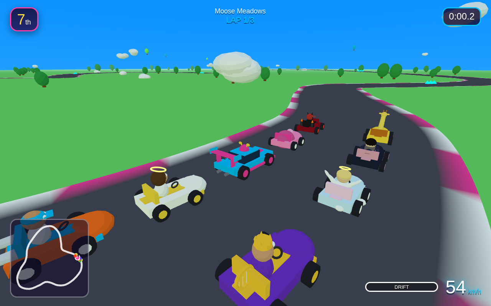
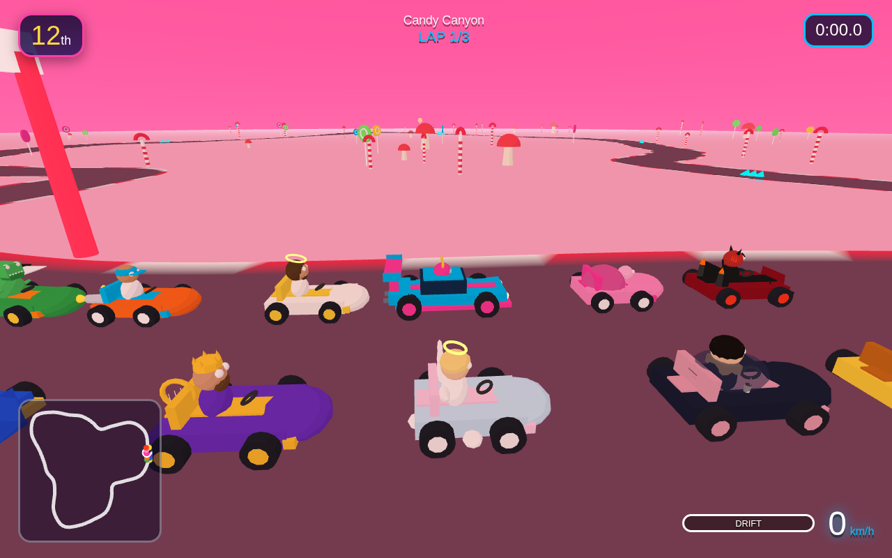
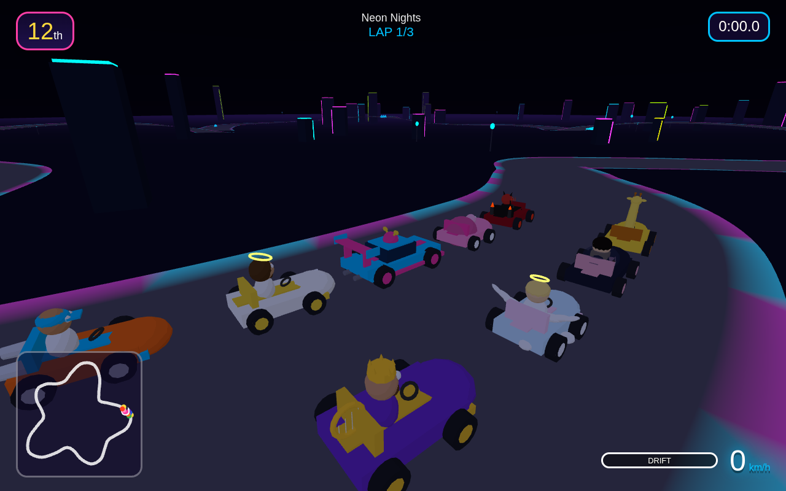
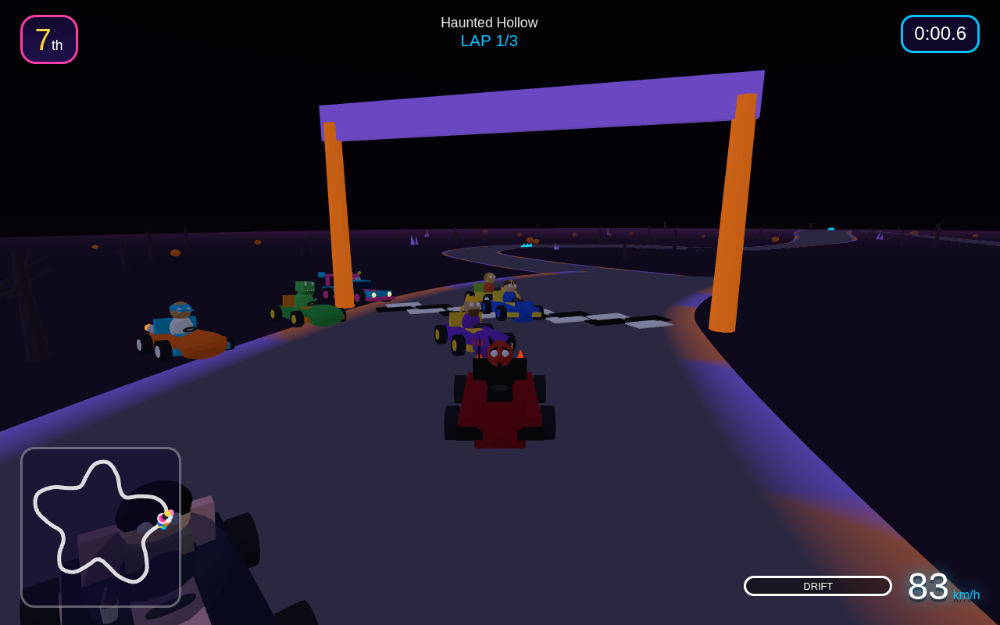
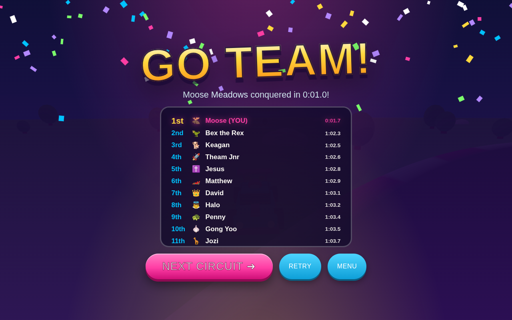

# 🏁 MOOSE RACER

**A vibrant 3D kart racing game starring Mathilda "Moose" Oosthuizen and her electric-blue & hot-pink Porsche GT3 RS.**

12 racers · 20 hand-designed circuits · 1 guaranteed loser (sorry, Satan)



## ▶️ Play

It's a fully static site — no build step, no dependencies to install:

```bash
# any static file server works:
python3 -m http.server 8000
# then open http://localhost:8000
```

Or deploy the repo as-is to GitHub Pages / Netlify / Vercel.

## 🎮 Controls

| Key | Action |
|---|---|
| `↑` / `W` | Accelerate |
| `↓` / `S` | Brake / reverse |
| `←` `→` / `A` `D` | Steer |
| `SPACE` (hold in corners) | **Drift** — charges a turbo boost, release to blast off |
| `P` / `ESC` | Pause |
| `M` | Music on/off |

An interactive driving-school tutorial runs the first time you play.

## 🏎 The Roster

Every kart and driver is procedurally built from Three.js primitives with cel shading — no downloaded assets, one cohesive cartoon world.

| Racer | Ride |
|---|---|
| **Moose** (Mathilda Oosthuizen) | Electric-blue & hot-pink **Porsche GT3 RS** with a swan-neck wing and antler helmet |
| **Keagan** the Golden Retriever | Tennis-ball buggy, wagging tail included |
| **Bex the Rex** | Jungle jeep with back spikes and famously tiny arms |
| **Matthew** (brother) | Cobalt arrow speedster |
| **Theam Jnr** (brother) | Twin-rocket go-kart |
| **David** (King & brother) | Royal golden chariot-kart with harp |
| **Jesus** | Radiant white-and-gold kart, glowing halo, dove hood ornament |
| **Halo** the Littlest Angel | Cloud kart with flapping feathered wings |
| **Gong Yoo** (공유) | Midnight & rose-gold grand tourer with an iced americano |
| **Penny** the Pink Turtle | Shell-domed slowpoke with something to prove |
| **Jozi** the Yellow Giraffe | Tallest racer on the grid |
| **Satan** | Spiky hell-rod. **Always finishes last. Every race. It's the rules.** |

## 🗺 The 20 Circuits

Each course is a unique closed-spline layout with its own elevation profile, palette, sky, fog and themed scenery — from **Moose Meadows** and **Candy Canyon** through **Neon Nights**, **Volcano Vortex**, **Heaven's Highway** and **Space Station Zero**, all the way to the rainbow-road finale, **GO TEAM Galaxy**. Finish on the podium (top 3) to unlock the next circuit; best times are saved locally.

| | | |
|---|---|---|
|  |  |  |

## 🎉 GO TEAM!

Win a race and the confetti flies:



## 🔧 Tech

- **Three.js** (vendored, zero CDN dependencies) — cel-shaded low-poly 3D, gradient-shader skies, particle systems
- **Procedural everything**: karts, drivers, track ribbons (Catmull-Rom splines with harmonic layouts), scenery, snow/petals/aurora effects
- **Procedural WebAudio**: per-track chiptune soundtrack, engine hum, arcade SFX — no audio files
- Arcade physics: drift-to-turbo, boost pads, rubber-band AI, kart-vs-kart collisions
- `localStorage` progression (unlocks, best times)
- And a hard metaphysical constraint in `js/race.js` ensuring Satan never, ever wins

*Built with 💙💖 for Team Moose. GO TEAM!*
